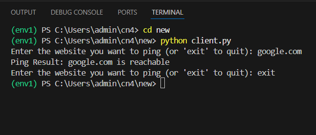
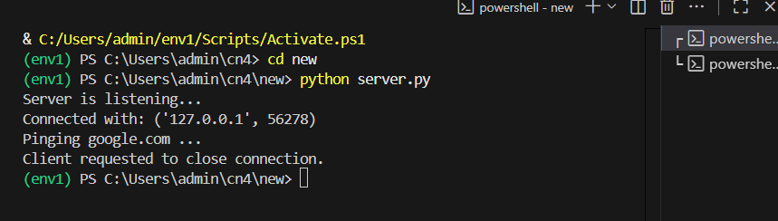

# 4.Execution_of_NetworkCommands
## AIM :Use of Network commands in Real Time environment
## Software : Command Prompt And Network Protocol Analyzer
## Procedure: To do this EXPERIMENT- follows these steps:
<BR>
In this EXPERIMENT- students have to understand basic networking commands e.g cpdump, netstat, ifconfig, nslookup ,traceroute and also Capture ping and traceroute PDUs using a network protocol analyzer 
<BR>
All commands related to Network configuration which includes how to switch to privilege mode
<BR>
and normal mode and how to configure router interface and how to save this configuration to
<BR>
flash memory or permanent memory.
<BR>
This commands includes
<BR>
• Configuring the Router commands
<BR>
• General Commands to configure network
<BR>
• Privileged Mode commands of a router 
<BR>
• Router Processes & Statistics
<BR>
• IP Commands
<BR>
• Other IP Commands e.g. show ip route etc.
<BR>

## Program
### Client.py
```
import socket

s = socket.socket()
s.connect(('localhost', 8000))

while True:
    ip = input("Enter the website you want to ping (or 'exit' to quit): ")
    s.send(ip.encode())
    if ip.lower() == 'exit':
        break

    data = s.recv(1024).decode()
    print("Ping Result:", data)

s.close()

```
### Server.py
```
import socket
import os

# Create socket
s = socket.socket()
s.bind(('localhost', 8000))
s.listen(5)
print("Server is listening...")

# Accept client connection
c, addr = s.accept()
print("Connected with:", addr)

while True:
    hostname = c.recv(1024).decode()
    if not hostname:
        break
    if hostname.lower() == 'exit':
        print("Client requested to close connection.")
        break

    print(f"Pinging {hostname} ...")

    # Ping the host (works on Windows; use -c for Linux/Mac)
    response = os.system(f"ping -n 1 {hostname} > nul")

    if response == 0:
        c.send(f"{hostname} is reachable ".encode())
    else:
        c.send(f"{hostname} is not reachable ".encode())

c.close()
s.close()

```
## Output
### Client.py

### Server.py

## Result
Thus Execution of Network commands Performed 
